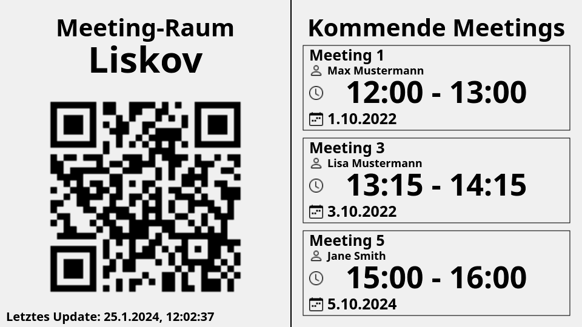

# Paper Image Server

This project provides a simple implementation for a web server that serves images of upcoming events to an e-paper display that runs the [paper-display](https://github.com/dhartung/paper-display) project. The server renders and sends images of the upcoming event to the client.

  
Example of rendered image

## Usage

You need to have [Node.js](https://nodejs.org/) in version 21 installed. Then, run `npm install` to install the required dependencies. You can start the development server by running `npm run dev`.

Before using the frontend you have to build it with `cd interface && npm i && npm run build`.

An alternative way is to use Docker. First, build the docker image using `docker build -t paper-image-server`. An example docker-compose file can be found
in the root directory for running your docker image.

### Configuration

The server can be configured using environment variables. The following environment variables are available:

| Environment Variable | Description | Default Value |
| --- | --- | --- |
| PAPER_PORT | The port the server should listen on. | 3000 |
| PAPER_BASE_PATH | The base path for the server. Can be used when the server is used behind a reverse proxy. | /generate |